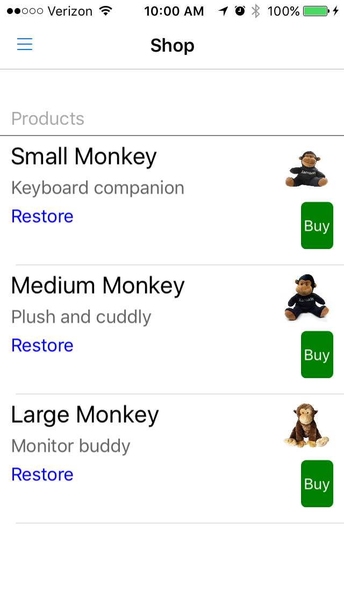
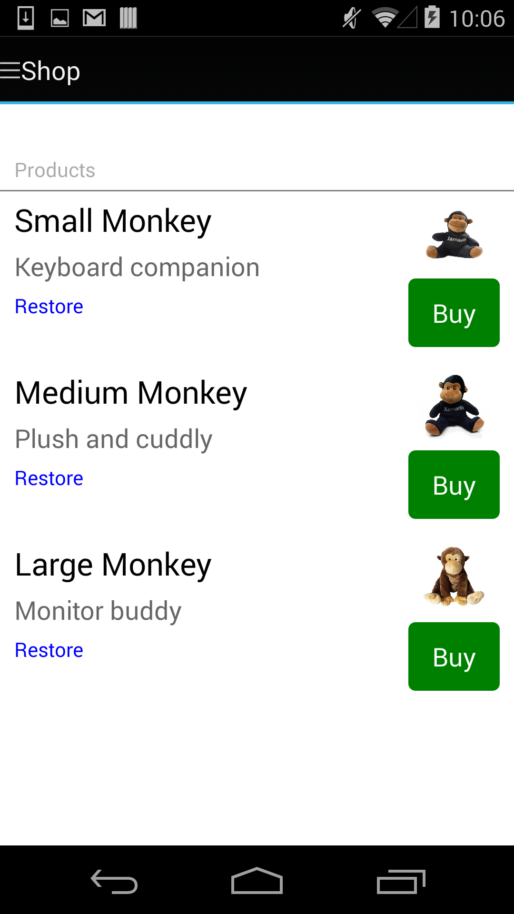

<h2><a href="http://simsip-admin.github.io/InApp/">Xamarin Forms Dependency Service for In-App Purchases</a></h2>

Xamarin Forms &bull; DependencyService &bull; In-App Purchases

Xamarin Forms support for cross-platform in-app purchasing.

  

----------

<h2><a href="http://simsip-admin.github.io/FortumoInApp/">Xamarin Forms Dependency Service for Carrier In-App Purchases (Fortumo)</a></h2>

Binding a Java Library &bull; Xamarin Forms &bull; DependencyService &bull; In-App Purchases &bull; Carrier Billing

Xamarin Forms support for cross-platform in-app purchasing via Fortumo for carrier billing.

----------

<h2><a href="http://linerunner3d.com">LineRunner 3D</a></h2>

MonoGame &bull; Cocos2D-XNA/CocosSharp &bull; Internationalization &bull; File handling &bull; Sqlite.Net &bull; In-app Purchasing &bull; Advertising &bull; HockeyApp

Set on a gigantic pad of paper, tap your way through a three dimensional world of lines and obstacles.

Use advanced controls to help you navigate:

* rotate and scroll your view
* zoom in and out
* change your speed
* pause and resume

Download for free.

##### Upgrade

Upgrade to practice mode so you can jump to any page or line and turn kills off.

Availabe in 15 languages on the following stores:

* iOS
* Android

Pending in the following stores (China):

* Mobile 360
* Tencent

~

<iframe width="560" height="315" src="https://www.youtube.com/embed/JlOxO9rtKj8?rel=0" frameborder="0" allowfullscreen></iframe>

~

----------

<h2><a href="http://simsip-admin.github.io/Play/">Legacy Google Play Binding</a></h2>

Binding a Java Library &bull; Java Bindings Metadata 

Xamarin binding to a legacy Google Play release. This was before the Google Play component from Xamarin had stabilized. Has good examples of handling Binding issues.

----------

<h2><a href="http://simsip-admin.github.io/Models/">Slack Sandbox</a></h2>
Xamarin Forms &bull; Custom Rendering &bull; Xamarin.Auth &bull; Refit

Beginning sandbox repository for building out a Xamarin Forms implementation for Slack. Currently has the Xamarin.Auth in place and building out web api with Refit.

